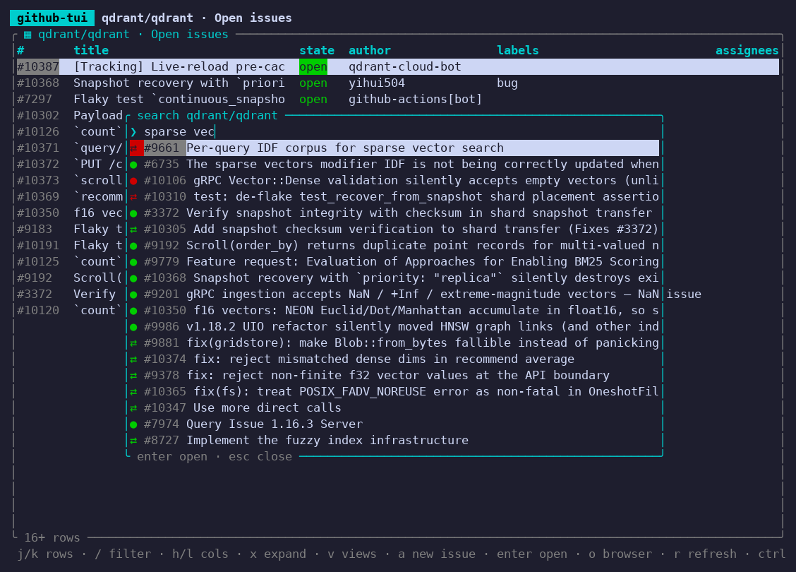
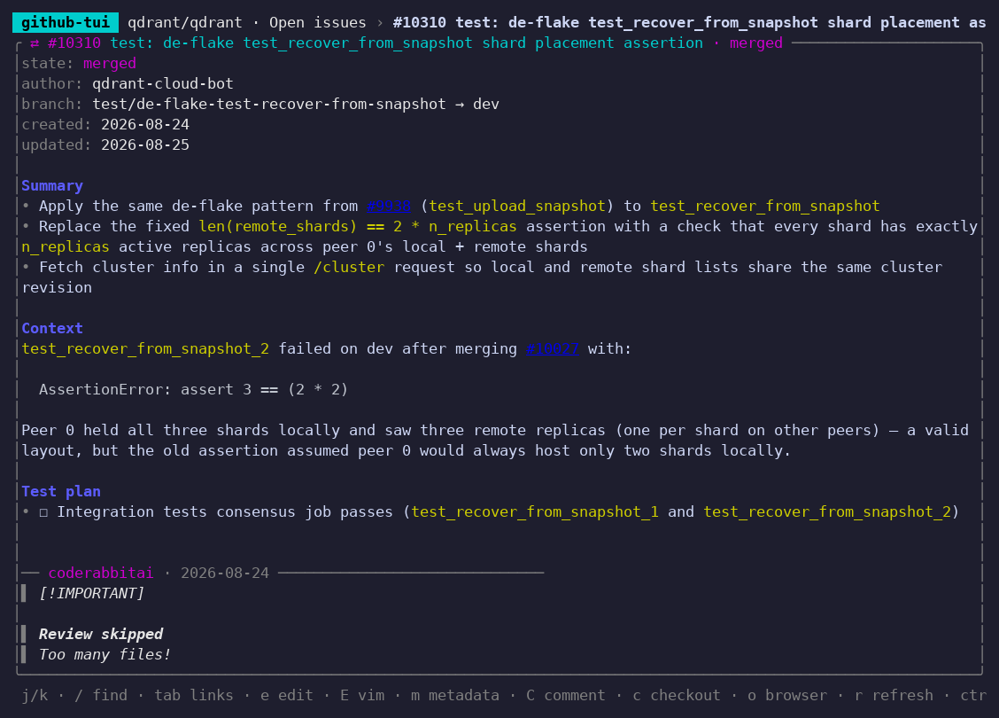
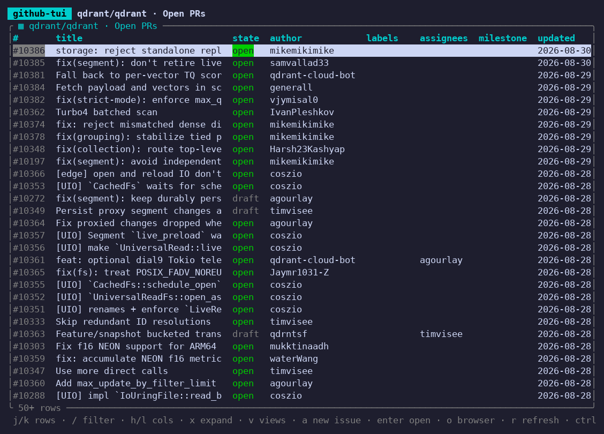
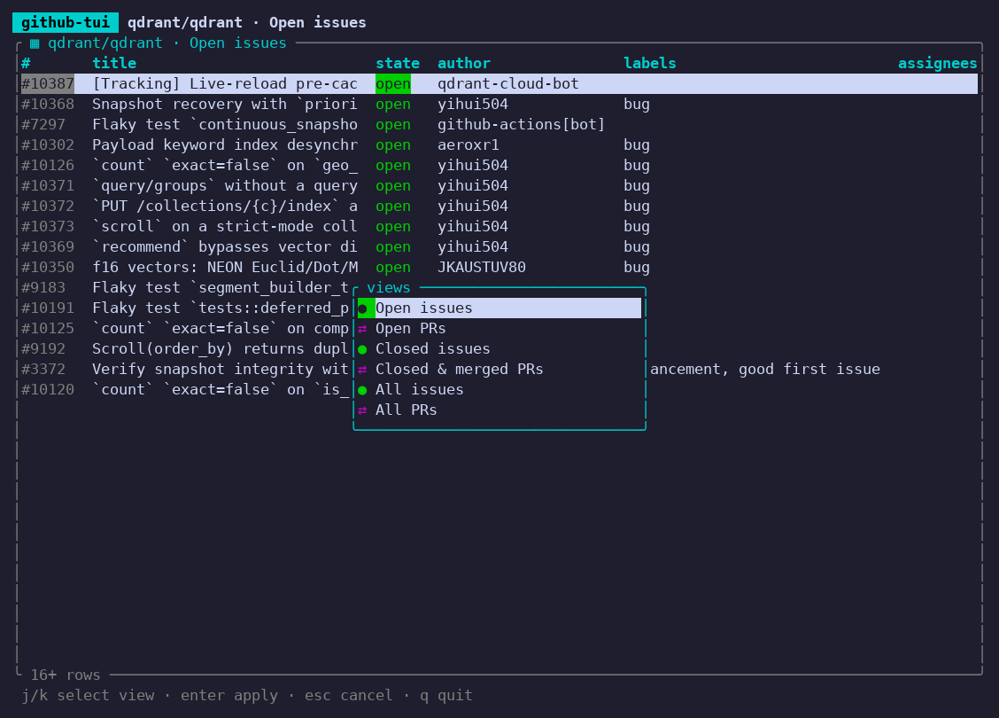
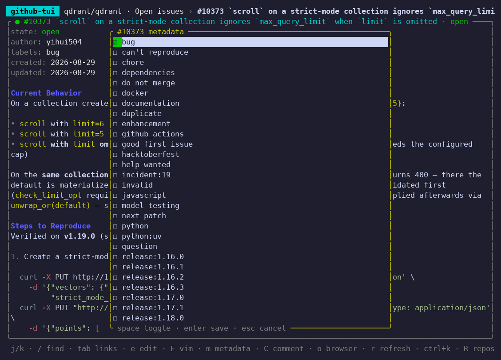
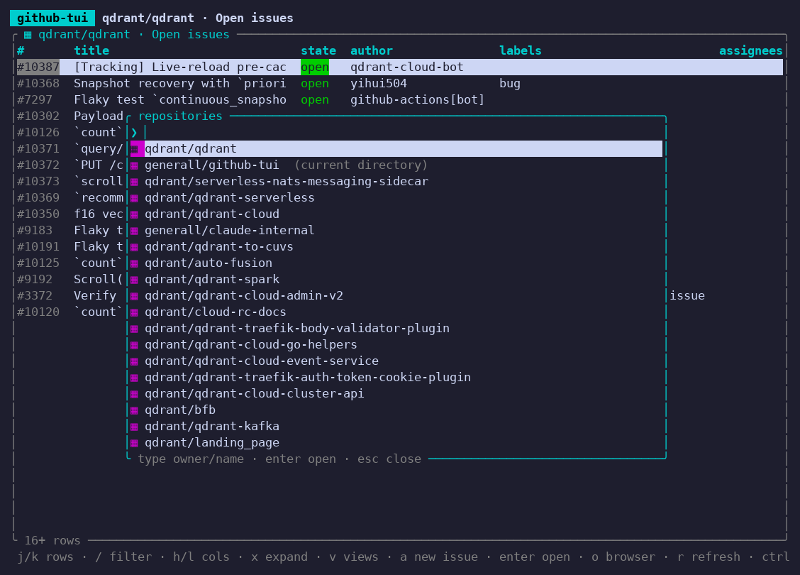

# github-tui

k9s-style terminal UI for GitHub issues and pull requests, backed by the [`gh` CLI](https://cli.github.com).



<details>
<summary>More screenshots</summary>

Pull request page — markdown body with syntax-highlighted code, then the comments and reviews:



Issue / PR lists with view switching:





Metadata editor — labels multi-pick:



Repo picker:



</details>

- Launched inside a checkout it opens that repo automatically, and the PR of the
  checked-out branch on top if there is one. `R` switches repos (your repos, or any
  typed `owner/name`); `github-tui owner/repo`, `owner/repo#N` or `#N` jump straight there.
- Lists of issues / PRs (open, closed, all — `v` to switch) as a table; rows open as pages
  rendering the body and comments as syntax-highlighted markdown, with `#123` references
  and GitHub URLs navigable in-app.
- `ctrl+k` search palette: keystrokes re-rank known items instantly client-side.
  Every query word must match; word-start matches beat mid-word beat fuzzy, and
  within a tier items you open often/recently win (zoxide-style frecency), then
  shorter titles. GitHub's search API fills in unknown items asynchronously —
  its body-only matches stay listed below the title matches. Everything you
  touch — visited items, list rows, past search results — joins a persistent
  local pool (capped at 2000).
- Edit the body in a minimal vim-like in-place editor (edtui, `e`) or in your real
  `$VISUAL`/`$EDITOR` git-style (`E`). `m` edits metadata field by field: title, state,
  labels, assignees, milestone, and for PRs draft, reviewers and base branch — all
  through `gh issue|pr edit/close/reopen/ready`. `C` comments, `a` files a new issue.
- `c` checks out the PR you are looking at (`gh pr checkout`) when the current
  directory is a checkout of its repo.
- Stale-while-revalidate cache (memory + `~/.cache/github-tui/cache.json`): cached
  items/lists render instantly on navigation while a background refresh runs (⟳ in the header).

## Install

Grab a prebuilt binary from the [latest release](https://github.com/generall/github-tui/releases/latest):

```sh
# Linux x86_64 (static musl — works on any distro)
curl -L https://github.com/generall/github-tui/releases/latest/download/github-tui-x86_64-unknown-linux-musl -o github-tui

# macOS Apple Silicon
curl -L https://github.com/generall/github-tui/releases/latest/download/github-tui-aarch64-apple-darwin -o github-tui

# macOS Intel
curl -L https://github.com/generall/github-tui/releases/latest/download/github-tui-x86_64-apple-darwin -o github-tui

chmod +x github-tui && ./github-tui
```

macOS note: the binaries are unsigned; if Gatekeeper complains, clear the
quarantine flag with `xattr -d com.apple.quarantine github-tui`.

Or build from source: `cargo build --release` → `target/release/github-tui`.

Upgrade an installed binary in place with:

```sh
github-tui self-upgrade
```

## Requirements

- `gh` in `$PATH`, authenticated (`gh auth login`).

## Keys

| Context | Key | Action |
|---|---|---|
| anywhere | `ctrl+k` | search palette for the current repo (empty query = recently updated) |
| anywhere | `R` | repo picker (type any `owner/name` to open it) |
| anywhere | `esc` / `backspace` | back (on root: reopen search) |
| anywhere | `r` | refresh current item/list |
| anywhere | `o` | open in browser |
| anywhere | `q` / `ctrl+c` | quit |
| list | `j/k` `g/G` | select row (bottom + `j` loads the next page) |
| list | `h/l` | scroll columns (number + title stay pinned) |
| list | `/` | filter rows live (matches any column); `esc` clears |
| list | `x` | toggle expanded view: cells wrap instead of truncating |
| list | `v` | switch view: open/closed/all × issues/PRs |
| list | `enter` | open row |
| list | `a` | new issue: `$EDITOR` opens; first `# heading` = title, rest = body |
| item | `j/k` `ctrl+d/u` `g/G` | scroll |
| item | `/` then `n`/`N` | find in page (highlighted), next/prev match; `esc` clears |
| item | `tab` / `shift+tab` | cycle links (`#123`, issue/PR urls, external urls) |
| item | `enter` | open selected link (external urls via `xdg-open`/`open`) |
| item | `e` | edit body in embedded vim-like editor |
| item | `E` | edit body in your real `$VISUAL`/`$EDITOR` (git-style) |
| item | `m` | metadata editor: pick a field, then type-aware editing |
| metadata | `enter` | state/draft toggle; labels/assignees/reviewers open a multi-pick (`space` toggles); milestone opens a picker; title/base get an inline input |
| item | `C` | comment (`$EDITOR`) |
| item (PR) | `c` | `gh pr checkout` into the current directory |
| editor | vim keys | edtui: normal/insert/visual modes |
| editor | `ctrl+s` / `ctrl+q` | save & close / discard |
| search / repos | type / `↑↓` / `enter` | query / select / open |
